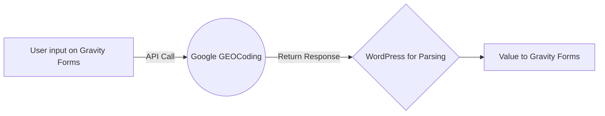

# Gravity Forms - Zipcode Look Up

This is a code snippet that we wrote that takes the zipcode a user types in and it uses the Google GEOCoding API to grab the city and state for the zip code provided.

This is a Loom video that walks you through how to create a GEOCoding API on Google: [https://www.loom.com/share/9ff5ff76c8a948699e1b0b8be8cf64a1](https://www.loom.com/share/9ff5ff76c8a948699e1b0b8be8cf64a1)

