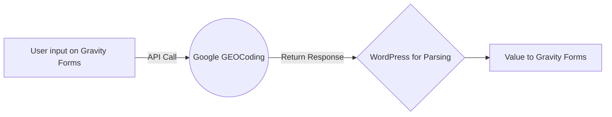

# Gravity Forms - Zipcode Look Up

This is a code snippet that we wrote that takes the zipcode a user types in and it uses the Google GEOCoding API to grab the city and state for the zip code provided.

This is a Loom video that walks you through how to create a GEOCoding API on Google: [https://www.loom.com/share/9ff5ff76c8a948699e1b0b8be8cf64a1](https://www.loom.com/share/9ff5ff76c8a948699e1b0b8be8cf64a1)

## Configuration Before Coding
In Gravity Forms, there are a few necessary steps before applying any of the code in the repository.

 1. Locate the ID of the form and make note of that somewhere. This ID will replace the placeholder of [form-id] in the code.
 2. Create 3 hidden fields. city, longState and shortState and make note of each of those IDs as well. These IDs will replace [city-id], [shortState-id] and [longState-id] in the code.
 3. You will need an API Key provided by the client. In the documentation above, there is a Loom video that walks the user through on how to obtain an API key. This API key will replace [api-key] in the code.

## Coding
You're now ready to move onto the code. The snippet can be found in functions.php in this repository. Simply add this snippet to your functions.php in WordPress (Child theme takes priority over parent theme).
